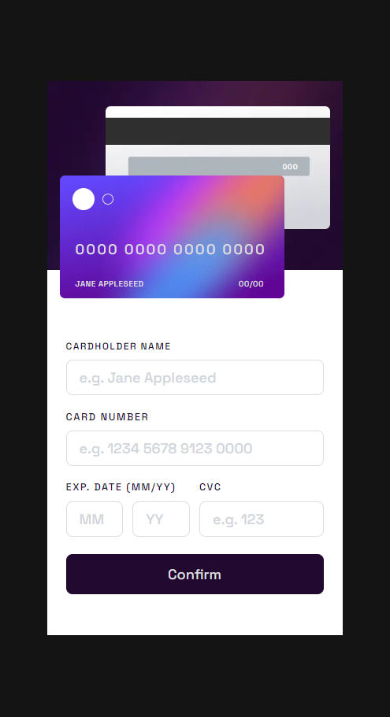
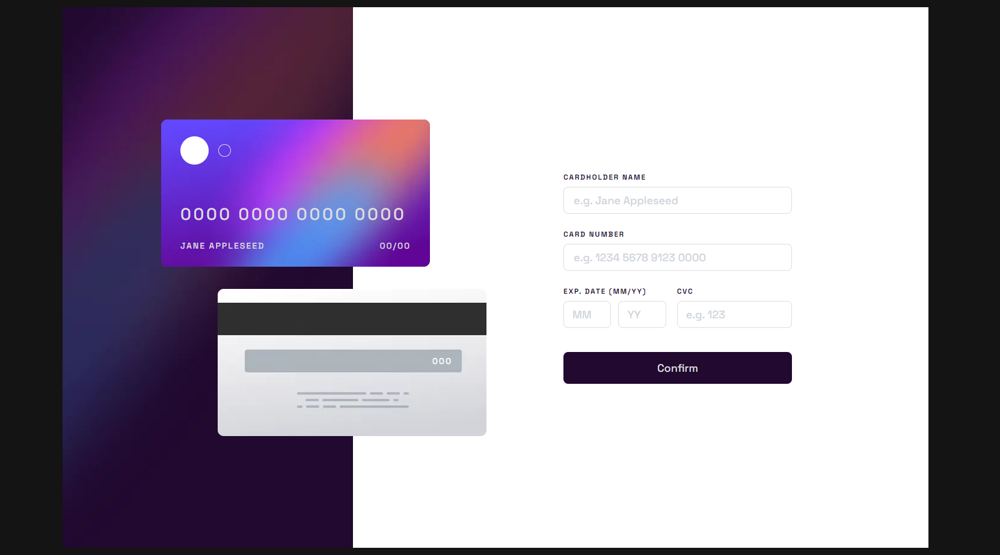

# Frontend Mentor - Interactive card details form solution

This is a solution to the [Interactive card details form challenge on Frontend Mentor](https://www.frontendmentor.io/challenges/interactive-card-details-form-XpS8cKZDWw). Frontend Mentor challenges help you improve your coding skills by building realistic projects.

## Table of contents

- [Overview](#overview)
  - [The challenge](#the-challenge)
  - [Screenshot](#screenshot)
  - [Links](#links)
- [My process](#my-process)
  - [Built with](#built-with)
  - [What I learned](#what-i-learned)
- [Author](#author)

## Overview

### The challenge

Users should be able to:

- Fill in the form and see the card details update in real-time
- Receive error messages when the form is submitted if:
  - Any input field is empty
  - The card number, expiry date, or CVC fields are in the wrong format
- View the optimal layout depending on their device's screen size
- See hover, active, and focus states for interactive elements on the page

### Screenshot

### Links

- Solution URL: [https://github.com/sjohnston82/interactive-card-details](https://github.com/sjohnston82/interactive-card-details)
- Live Site URL: [Add live site URL here](https://your-live-site-url.com)

## My process

### Built with

- Flexbox
- TailwindCSS
- React-hook-form
- Zod
- Mobile-first workflow
- [React](https://reactjs.org/) - JS library
- [Next.js](https://nextjs.org/) - React framework

### What I learned

This was a fun project, I am starting to get comfortable using react-hook-form with zod to do form validation. I ended up using an online pixel ruler (https://www.rapidtables.com/web/tools/pixel-ruler.html) that I felt helped me to get the dimensions of the copy to replicate it as closely as possible.

## Author

- Website - [Stephen Johnston](https://www.stephenmjohnston.net)
- Frontend Mentor - [@sjohnston82](https://www.frontendmentor.io/profile/sjohnston82)
